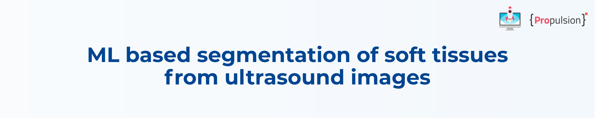
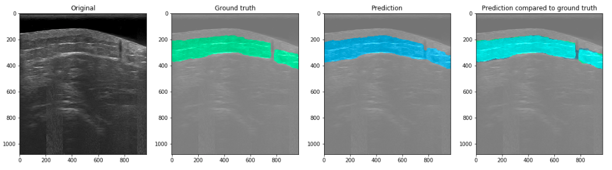
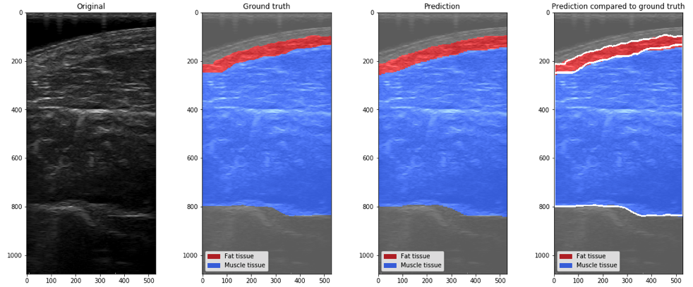
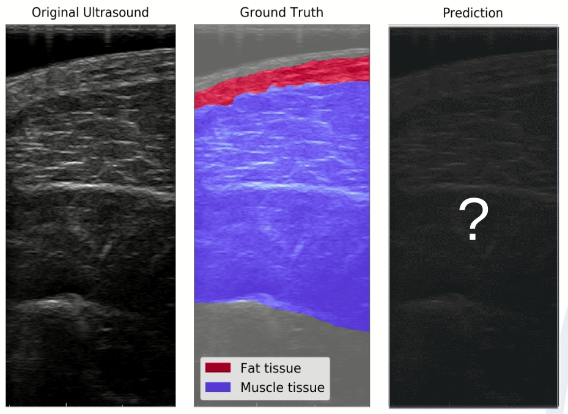
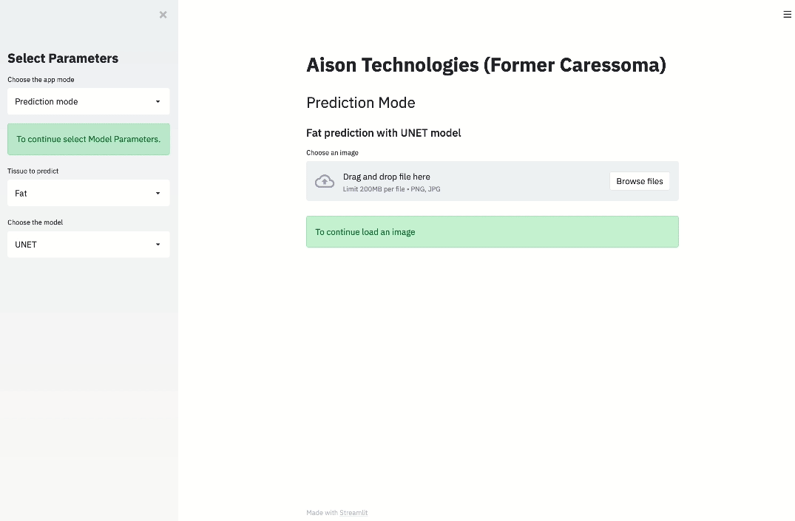

This repository contains the complete Propulsion Academy final project on ultrasound image segmentation.
The project was done in collaboration with our industry partner.

## Authors
[Leticia Fernandez Moguel](https://www.linkedin.com/in/leticia-fernandez-moguel-phd/),  [Roman Grisch](https://www.linkedin.com/in/romangrisch/), [Nicolas Bernath](https://www.linkedin.com/in/nicolasbernath/) 

## Supervisors
 [Marie Bocher](https://www.linkedin.com/in/marie-bocher-8b6b5562/), [Badru Stanicki](https://www.linkedin.com/in/badru-stanicki-087703187/)

## Project summary

Ultrasound (US) has become an increasingly popular diagnostic tool for visualizing soft tissue in all areas of medicine. However, US images are difficult to interpret; identifying tissues such as fat,
muscle, tendons, ligaments requires a trained specialist. 

We have developed a tool to identify such tissues on ultrasound images based 
on a deep learning model with a UNET architecture. The potential uses of this model are numerous: 
- assisting healthcare providers with US diagnosis 
- enable non-experts (e.g. physical therapists, personal trainers) to carry out US screenings 
- implentation in 3D ultrasound tomography (like an MRI or CT, but based on ultrasound technology)

## Data
Three diffrent datasets were used for this project:

- Dataset 1: 800 images & masks with two labels: fat & not fat
- Dataset 2: 1200 images & masks with two labels: fat & not fat
- Dataset 3: 400 images & masjs with three labels: fat, muscle, rest

The data are property of Aison Technologies and are not publicly available.

## Requirements

The [Environment](https://gitlab.propulsion-home.ch/datascience/bootcamp/final-projects/ds-2020-09/caressoma/-/blob/master/environment.yml) file contains all the needed  python packages to reproduce this project.

## How to work with this repo
Due to the different data sets, models for binary and multiclass segmentation were created. To run them, python scripts and jupyter notebooks are provided.

### Notebooks
Two notebooks are provided which allow to run the binary and multiclass models. 

### Scripts
Detailed description about each script can be found here:[Library](https://gitlab.propulsion-home.ch/datascience/bootcamp/final-projects/ds-2020-09/caressoma/-/blob/master/library/README.md)

The following scripts are available
#### Part 1: Processing the data
- **data_preprocessing.py**: To preprocess and load the data
- **data_augmentation.py** to create new augmented data to increase the amount and diversity of data.

#### Part 2: Running the code
- **train.py** to train the model on the prepared datasets. The best result is than saved in .h5 format.
- **predict.py** to load the pretrained model, and make prediction on unseen data (test-set). 
The predicted images are then saved in a predefined folder.

## Example Results
While running the python scripts produce a output mask ans save them in a folder, the jupyter notebooks allow to plot the predictions which facilitates a direct comparison to the ground truth mask.
The figures below show the outputs of the models when running them with the jupyter notebook. They allow to see the ultrasound image, the mask, how the model predicted the mask and lastly, a comparison between predicted & actual mask.

#### Binary Model

#### Multiclass Model

#### Visualization of model training (backpropagation in neural network)

##  App

An App was created with [streamlit](https://www.streamlit.io). The App contains a Demo mode showing pre-loaded predictions, an animation of the training progress and the prediction mode which predict ultrasound segmentation on the spot.
To run the App it is necessary:
- Clone on a local PC this repo
- Make sure the environment from the requirement section is installed
- IMPORTANT: Keep the folder structure
- Open the terminal at the App folder and type: `streamlit run AISON_APP.py`

#### Example of the App in use: predicting body tissue on new US image

